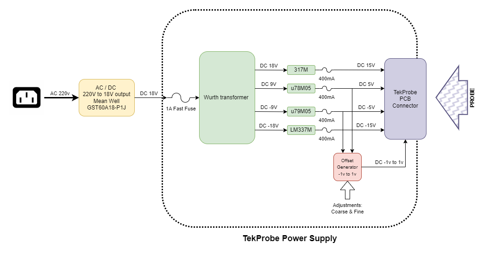

<!-- https://github.com/ritaly/README-cheatsheet/blob/master/README.md -->

# Tekprobe power supply
> A 1 channel power supply and adapter for the Tektronix's Tekprobe interface capable of supplying the duals voltages (-5V/5V DC and -15V/15V DC) and also the offset voltage (-1v to 1v). 

## Table of Contents
* [General Info](#general-information)
* [Features](#features)
* [Screenshots](#screenshots)
* [Setup](#setup)
* [Usage](#usage)
* [Project Status](#project-status)
* [Acknowledgements](#acknowledgements)
* [Contact](#contact)

## General Information
I've had for a few months a very good precision current probe with almost no use siting in my bench incapable of using it in my oscilloscope because it uses a propietary and obsolete Tekprobe connection. The idea of creating has been kicking arround in the back of my mind and by sure is not a new idea, see [Acknowledgements](#acknowledgements) to other webpages where I got the information, and while this design is mine for sure is inspired and remixed from the different sources.

## Features
- 1 channel but easily replicable to create a dual or triple power supply with the same power supply.
- Offset coarse and fine adjustment, something that other power supply project lack.
- Power from main through the help of a 19v power supply (To reuse an old laptop power supply)
  

## Screenshots

> Tekprobre power supply architecture
<!-- If you have screenshots you'd like to share, include them here. -->

## Project Status
Project is: _in progress_ 

## Acknowledgements
Give credit here.
- [Ritaly](https://github.com/ritaly) for this awesome readme template [README cheatsheet](https://github.com/ritaly/README-cheatsheet)
- Jay_Diddy_B in the EEVblog forum for the initial project [Link](https://www.eevblog.com/forum/projects/tektronix-tekprobe-power-supply-for-agilent-rigol-and-other-oscilloscopes/)
- Grease Monkey for his implementation  [Link](https://btbm.ch/a-usb-power-supply-for-the-tekprobe-interface/)

## Contact
Borja Herranz @herranz - feel free to contact me!

<!--
## Table of Contents
* [General Info](#general-information)
* [Technologies Used](#technologies-used)
* [Features](#features)
* [Screenshots](#screenshots)
* [Setup](#setup)
* [Usage](#usage)
* [Project Status](#project-status)
* [Room for Improvement](#room-for-improvement)
* [Acknowledgements](#acknowledgements)
* [Contact](#contact)
<!-- * [License](#license) -->
<!--

## General Information
- Provide general information about your project here.
- What problem does it (intend to) solve?
- What is the purpose of your project?
- Why did you undertake it?
<!-- You don't have to answer all the questions - just the ones relevant to your project. -->

<!--
## Technologies Used
- Tech 1 - version 1.0
- Tech 2 - version 2.0
- Tech 3 - version 3.0

## Features
List the ready features here:
- Awesome feature 1
- Awesome feature 2
- Awesome feature 3

## Screenshots

<!-- If you have screenshots you'd like to share, include them here. -->

<!--
## Setup
What are the project requirements/dependencies? Where are they listed? A requirements.txt or a Pipfile.lock file perhaps? Where is it located?

Proceed to describe how to install / setup one's local environment / get started with the project.

## Usage
How does one go about using it?
Provide various use cases and code examples here.

`write-your-code-here`

## Project Status
Project is: _in progress_ / _complete_ / _no longer being worked on_. If you are no longer working on it, provide reasons why.

## Room for Improvement
Include areas you believe need improvement / could be improved. Also add TODOs for future development.

Room for improvement:
- Improvement to be done 1
- Improvement to be done 2

To do:
- Feature to be added 1
- Feature to be added 2

## Acknowledgements
Give credit here.
- This project was inspired by...
- This project was based on [this tutorial](https://www.example.com).
- Many thanks to...

## Contact
Created by [@flynerdpl](https://www.flynerd.pl/) - feel free to contact me!

<!-- Optional -->
<!-- ## License -->
<!-- This project is open source and available under the [... License](). -->

<!-- You don't have to include all sections - just the one's relevant to your project -->
